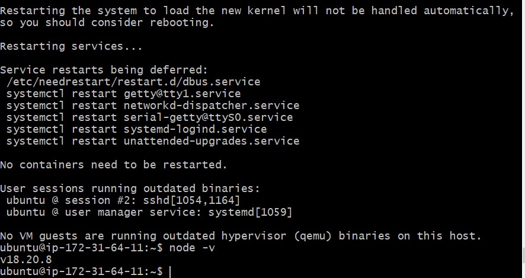
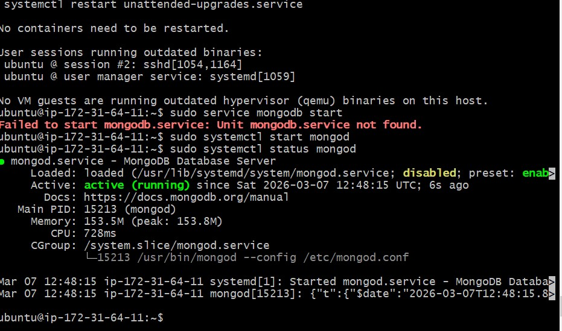
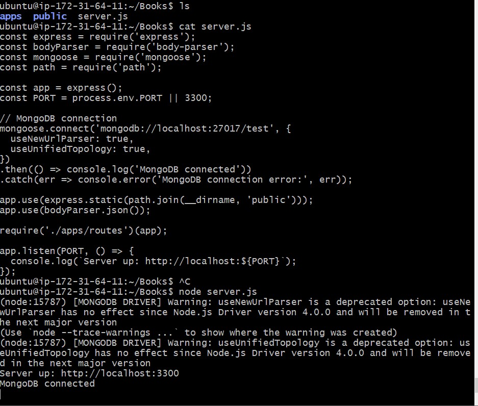
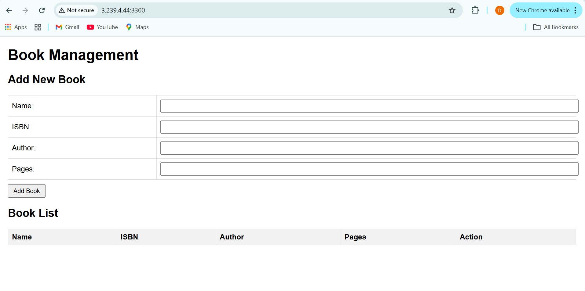
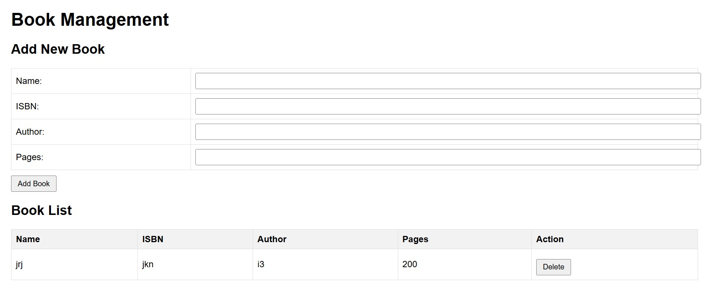

# MEAN Stack Book Management System

A full-stack Book Management application built on the MEAN stack, deployed on an Ubuntu EC2 instance on AWS. The app allows users to save and delete book records through a browser interface backed by a locally installed MongoDB database.

---

## Table of Contents

1. [Project Overview](#project-overview)
2. [Architecture & Design Choices](#architecture--design-choices)
3. [Prerequisites](#prerequisites)
4. [Step 1 – AWS EC2 Instance Setup](#step-1--aws-ec2-instance-setup)
5. [Step 2 – Ubuntu System Configuration](#step-2--ubuntu-system-configuration)
6. [Step 3 – Node.js Installation](#step-3--nodejs-installation)
7. [Step 4 – MongoDB Installation & Configuration](#step-4--mongodb-installation--configuration)
8. [Step 5 – Express.js & Node.js Backend](#step-5--expressjs--nodejs-backend)
9. [Step 6 – Angular Frontend](#step-6--angular-frontend)
10. [Step 7 – Running the Application](#step-7--running-the-application)
11. [API Endpoints](#api-endpoints)
12. [Screenshots](#screenshots)

---

## Project Overview

This project is a **Book Management System** built on the MEAN stack — a JavaScript-only technology stack that handles every layer of the application using a single language, from the database to the user interface.

| Component | Technology | Role |
|-----------|-----------|------|
| **M**ongoDB | MongoDB 6.x (local) | NoSQL database installed on EC2 |
| **E**xpress.js | Express 4.x | REST API & server-side routing |
| **A**ngular | Angular 16.x | Frontend single-page application |
| **N**ode.js | Node.js 18.x LTS | JavaScript runtime environment |

**Supported operations:**
- ✅ View all books — `HTTP GET`
- ✅ Add a new book record — `HTTP POST`
- ✅ Delete a book record — `HTTP DELETE`

---

## Architecture & Design Choices

### Why a Local MongoDB Install Instead of Atlas?

MongoDB is installed **directly on the EC2 instance** rather than using a cloud service like Atlas. This approach was chosen to:

- Gain hands-on experience with MongoDB installation and configuration on a Linux server
- Keep all components of the stack on a single machine, reflecting a self-contained server deployment
- Understand how MongoDB integrates at the OS level — including service management with `systemctl`, config file editing, and log monitoring

### Stack Communication Flow

```
User (Browser)
      │
      ▼
Angular Frontend (Port 3300)
      │  HTTP Requests (Angular HttpClient)
      ▼
Express.js REST API (Port 3300 via Node.js)
      │  Mongoose ODM queries
      ▼
MongoDB (Port 27017 — localhost only)
Installed on the same EC2 instance
```

### Why MEAN?

The MEAN stack uses **JavaScript end-to-end** — the same language across the Angular frontend, Node/Express backend, and Mongoose database queries. This reduces context-switching and allows a single developer to own the full application.

---

## Prerequisites

- An AWS account with permission to launch EC2 instances
- An SSH key pair (`.pem` file) for EC2 access
- A local terminal with SSH installed
- Port `3300` open in the EC2 Security Group inbound rules
- Basic familiarity with the Linux terminal

---

## Step 1 – AWS EC2 Instance Setup

### Launch the Instance

1. Log in to the **AWS Management Console** and navigate to **EC2 → Instances → Launch Instance**
2. Configure the instance with the following settings:

| Setting | Value |
|---------|-------|
| Name | `MEAN-Book-Server` |
| AMI | Ubuntu Server 22.04 LTS (HVM), SSD Volume Type |
| Instance Type | `t2.micro` (free tier eligible) |
| Key Pair | Create or select an existing `.pem` key pair |
| Storage | 8 GB gp2 (default) |

3. Under **Network Settings**, click **Edit** and add the following inbound rules:

| Type | Protocol | Port | Source |
|------|---------|------|--------|
| SSH | TCP | 22 | My IP |
| Custom TCP | TCP | 3300 | 0.0.0.0/0 |

> Port `3300` is where the MEAN application will be served. Port `22` is needed for SSH access.

4. Click **Launch Instance**

---

### Connect to the Instance via SSH

```bash
# Set correct permissions on your key pair file
chmod 400 your-key.pem

# Connect to the EC2 instance
ssh -i "your-key.pem" ubuntu@<your-ec2-public-ip>
```
## Step 2 – Ubuntu System Configuration

Once connected to the EC2 instance, update and upgrade all system packages before installing any software. This ensures compatibility and pulls in the latest security patches.

```bash
# Update the package index
sudo apt update

# Upgrade all installed packages to their latest versions
sudo apt upgrade -y
```

> The `-y` flag automatically confirms all upgrade prompts so the process runs without interruption.


## Step 3 – Node.js Installation

Node.js 18.x is installed from the official NodeSource repository. The Ubuntu default repository ships an outdated version of Node, so the NodeSource setup script is used to get the correct LTS version.

```bash
# Download and run the NodeSource setup script for Node.js 18.x
curl -fsSL https://deb.nodesource.com/setup_18.x | sudo -E bash -

# Install Node.js (npm is included automatically)
sudo apt-get install -y nodejs
```

```bash
# Verify Node.js version
node -v

# Verify npm version
npm -v
```

#### 📸 Screenshot – Terminal: Node.js and npm Version Confirmed
> _Should show the output of both `node -v` and `npm -v`, displaying version numbers such as `v18.x.x` and `9.x.x` — confirming Node.js and npm are installed correctly._



---

## Step 4 – MongoDB Installation & Configuration

MongoDB is installed directly on the EC2 instance. The official MongoDB repository is added to Ubuntu's package manager to ensure the correct version is installed.

### 4a. Import the MongoDB GPG Key

MongoDB's packages are signed with a GPG key. Ubuntu needs this key to verify the packages are authentic before installing them.

```bash
# Install the required package for adding HTTPS repositories
sudo apt-get install -y gnupg curl

# Import the MongoDB public GPG key
curl -fsSL https://www.mongodb.org/static/pgp/server-6.0.asc | \
   sudo gpg -o /usr/share/keyrings/mongodb-server-6.0.gpg --dearmor
```

### 4b. Add the MongoDB Repository

```bash
# Add the official MongoDB 6.0 repository to Ubuntu's sources list
echo "deb [ arch=amd64,arm64 signed-by=/usr/share/keyrings/mongodb-server-6.0.gpg ] \
https://repo.mongodb.org/apt/ubuntu jammy/mongodb-org/6.0 multiverse" | \
sudo tee /etc/apt/sources.list.d/mongodb-org-6.0.list

# Update the package index to include the new MongoDB repository
sudo apt-get update
```

### 4c. Install MongoDB

```bash
# Install the MongoDB server
sudo apt-get install -y mongodb-org
```
### 4d. Start and Enable the MongoDB Service

```bash
# Start the MongoDB service
sudo systemctl start mongod

# Enable MongoDB to start automatically on system reboot
sudo systemctl enable mongod

# Verify MongoDB is running
sudo systemctl status mongod
```

> The `enable` command ensures MongoDB restarts automatically if the EC2 instance is rebooted — important for a persistent deployment.

#### 📸 Screenshot – Terminal: MongoDB Service Active and Running
> _Should show the output of `sudo systemctl status mongod` with a green **"active (running)"** status, the process ID, memory usage, and recent log lines — confirming MongoDB started successfully._



---

### 4e. Verify MongoDB is Listening on Port 27017

```bash
# Confirm MongoDB is listening on its default port
sudo ss -tulnp | grep mongod
# OR
sudo netstat -tulnp | grep mongod
```

### 4f. Connect to the MongoDB Shell

```bash
# Open the MongoDB shell to confirm database access
mongosh
```

Inside the shell:

```javascript
// Show all databases
show dbs

// Create and switch to the books database
use booksdb

// Confirm you are in the right database
db
```

```bash
# Exit the shell
exit
```
## Step 5 – Express.js & Node.js Backend

### 5a. Project Setup

```bash
# Create the project directory
mkdir Books && cd Books

# Initialise the Node.js project
npm init -y

# Install backend dependencies
npm install express mongoose body-parser

# Install nodemon for development (auto-restarts on file changes)
npm install --save-dev nodemon
```

| Package | Purpose |
|---------|---------|
| `express` | Web framework for building the REST API |
| `mongoose` | ODM library for interacting with MongoDB |
| `body-parser` | Parses incoming JSON request bodies |
| `nodemon` | Auto-restarts server on code changes |


### 5b. Mongoose Book Schema

```bash
mkdir models && touch models/book.js
vim models/book.js
```

```javascript
// models/book.js
const mongoose = require('mongoose');
const Schema = mongoose.Schema;

const bookSchema = new Schema({
  name:   { type: String, required: true },
  isbn:   { type: String, required: true, unique: true },
  author: { type: String, required: true },
  pages:  { type: Number, required: true }
});

module.exports = mongoose.model('Book', bookSchema);
```

---

### 5c. API Routes

```bash
mkdir routes && touch routes/book.js
vim routes/book.js
```

```javascript
// routes/book.js
const express = require('express');
const router  = express.Router();
const Book    = require('../models/book');

// GET — retrieve all books
router.get('/book', async (req, res) => {
  try {
    const books = await Book.find();
    res.json(books);
  } catch (err) {
    res.status(500).json({ message: err.message });
  }
});

// POST — add a new book
router.post('/book', async (req, res) => {
  try {
    const book = new Book({
      name:   req.body.name,
      isbn:   req.body.isbn,
      author: req.body.author,
      pages:  req.body.pages
    });
    const saved = await book.save();
    res.status(201).json(saved);
  } catch (err) {
    res.status(400).json({ message: err.message });
  }
});

// DELETE — remove a book by ISBN
router.delete('/book/:isbn', async (req, res) => {
  try {
    await Book.findOneAndDelete({ isbn: req.params.isbn });
    res.json({ message: 'Book deleted successfully' });
  } catch (err) {
    res.status(500).json({ message: err.message });
  }
});

module.exports = router;
```

---

### 5d. Main Server Entry Point

```bash
touch server.js
vim server.js
```

```javascript
// server.js
const express    = require('express');
const bodyParser = require('body-parser');
const mongoose   = require('mongoose');
const path       = require('path');
const bookRoutes = require('./routes/book');

const app  = express();
const port = process.env.PORT || 3300;

// Connect to local MongoDB
mongoose.connect('mongodb://localhost:27017/booksdb', {
  useNewUrlParser:    true,
  useUnifiedTopology: true
})
.then(() => console.log('MongoDB connected successfully'))
.catch(err => console.error('MongoDB connection error:', err));

app.use(bodyParser.json());
app.use(bodyParser.urlencoded({ extended: true }));

// Serve static Angular files from the public folder
app.use(express.static(path.join(__dirname, 'public')));

// API routes
app.use('/api', bookRoutes);

// Catch-all: serve Angular app for any non-API route
app.get('*', (req, res) => {
  res.sendFile(path.join(__dirname, 'public', 'index.html'));
});

app.listen(port, () => {
  console.log(`Server running on port ${port}`);
});
```

```bash
# Start the server
node server.js
```

#### 📸 Screenshot – Terminal: Server Running and MongoDB Connected
> _Should show both **"MongoDB connected successfully"** and **"Server running on port 3300"** printed in the terminal — confirming the Express server is live and connected to the local MongoDB instance._



---

## Step 6 – Angular Frontend

### 6a. Install Angular CLI

```bash
# Install Angular CLI globally
sudo npm install -g @angular/cli

# Verify installation
ng version
```

### 6b. Create the Angular App

```bash
# From the Books directory, create the Angular project
ng new client --no-standalone --routing=false --style=css

cd client
```

---

### 6c. Book Service (HTTP Client)

```bash
ng generate service book
vim src/app/book.service.ts
```

```typescript
// src/app/book.service.ts
import { Injectable } from '@angular/core';
import { HttpClient } from '@angular/common/http';
import { Observable } from 'rxjs';

export interface Book {
  _id?:   string;
  name:   string;
  isbn:   string;
  author: string;
  pages:  number;
}

@Injectable({ providedIn: 'root' })
export class BookService {
  private apiUrl = '/api/book';

  constructor(private http: HttpClient) {}

  getBooks(): Observable<Book[]> {
    return this.http.get<Book[]>(this.apiUrl);
  }

  addBook(book: Book): Observable<Book> {
    return this.http.post<Book>(this.apiUrl, book);
  }

  deleteBook(isbn: string): Observable<any> {
    return this.http.delete(`${this.apiUrl}/${isbn}`);
  }
}
```

---

### 6d. App Component

```bash
vim src/app/app.component.ts
```

```typescript
// src/app/app.component.ts
import { Component, OnInit } from '@angular/core';
import { BookService, Book } from './book.service';

@Component({
  selector: 'app-root',
  templateUrl: './app.component.html',
  styleUrls: ['./app.component.css']
})
export class AppComponent implements OnInit {
  books: Book[] = [];
  newBook: Book = { name: '', isbn: '', author: '', pages: 0 };

  constructor(private bookService: BookService) {}

  ngOnInit(): void {
    this.loadBooks();
  }

  loadBooks(): void {
    this.bookService.getBooks().subscribe(data => this.books = data);
  }

  addBook(): void {
    this.bookService.addBook(this.newBook).subscribe(() => {
      this.loadBooks();
      this.newBook = { name: '', isbn: '', author: '', pages: 0 };
    });
  }

  deleteBook(isbn: string): void {
    this.bookService.deleteBook(isbn).subscribe(() => this.loadBooks());
  }
}
```

```bash
vim src/app/app.component.html
```

```html
<!-- src/app/app.component.html -->
<div style="max-width: 800px; margin: 40px auto; font-family: sans-serif;">
  <h1>Book Management System</h1>

  <h2>Add a Book</h2>
  <input [(ngModel)]="newBook.name"   placeholder="Book Name" />
  <input [(ngModel)]="newBook.isbn"   placeholder="ISBN" />
  <input [(ngModel)]="newBook.author" placeholder="Author" />
  <input [(ngModel)]="newBook.pages"  placeholder="Pages" type="number" />
  <button (click)="addBook()">Add Book</button>

  <h2>All Books</h2>
  <table border="1" cellpadding="8" style="width:100%; border-collapse:collapse;">
    <thead>
      <tr>
        <th>Name</th><th>ISBN</th><th>Author</th><th>Pages</th><th>Action</th>
      </tr>
    </thead>
    <tbody>
      <tr *ngFor="let book of books">
        <td>{{ book.name }}</td>
        <td>{{ book.isbn }}</td>
        <td>{{ book.author }}</td>
        <td>{{ book.pages }}</td>
        <td><button (click)="deleteBook(book.isbn)">Delete</button></td>
      </tr>
    </tbody>
  </table>
</div>
```

---

### 6e. Build Angular for Production

```bash
# Build the Angular app into static files
ng build --configuration production

# Copy the built files into the Express public folder
cp -r dist/client/* ../public/
```

The `ng build` command compiles the Angular app into static HTML, CSS, and JS files inside the `dist/` folder. These are then copied to the Express `public/` folder so Node.js can serve them directly.


## Step 7 – Running the Application

### Start the Server

```bash
# From the Books directory
node server.js

# OR with nodemon for development (auto-restarts on changes)
npx nodemon server.js

---

### Access the Application

Open a browser and navigate to:

```
http://<your-ec2-public-ip>:3300
```

#### 📸 Screenshot 18 – Browser: Book Management App Loaded
> _Should show the Angular Book Management System loaded in the browser at the EC2 public IP on port 3300, with the "Add a Book" form and the books table visible._



#### 📸 Screenshot 19 – Browser: Book Record Added and Displayed in Table
> _Should show the app after adding at least one book — with the book's name, ISBN, author, and page count visible in the table, and a Delete button next to it. This confirms the full MEAN stack is working end-to-end._



---

### Verify Data in MongoDB

```bash
# Open the MongoDB shell
mongosh

# Switch to the books database
use booksdb

# Query all book documents
db.books.find().pretty()
---

## API Endpoints

| Method | Endpoint | Description | Request Body |
|--------|---------|-------------|-------------|
| `GET` | `/api/book` | Retrieve all book records | None |
| `POST` | `/api/book` | Add a new book record | `{ name, isbn, author, pages }` |
| `DELETE` | `/api/book/:isbn` | Delete a book by ISBN | None |

---

*Project submitted as part of a MEAN Stack deployment exercise.*
